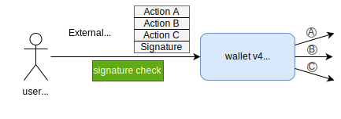
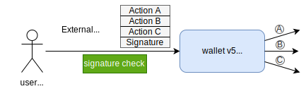
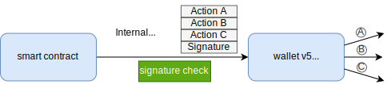
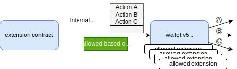
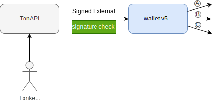
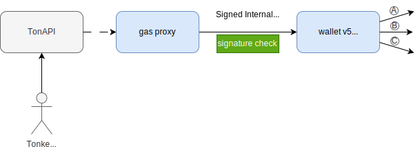
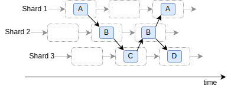
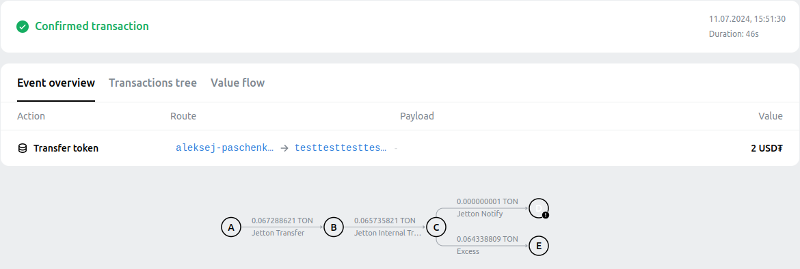
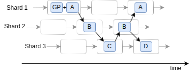

## Gasless transactions on TON

Finally, W5 has become the default wallet contract on TON supported by all major players in the ecosystem.
W4 being in production for almost two years is deprecated.

W5 is a significant improvement over W4 and will bring lots of new features to the TON ecosystem.
Gasless transactions are one of the most anticipated features.

This post will explain how gasless transactions work in TON and how they are implemented by Tonkeeper.

## Wallet v4

Wallet v4 is the most popular wallet contract on TON.
It has stood the test of time and has proven its reliability.
W4 is the first version that became widely adopted.

The only type of messages W4 works with is an external message:

| W4 handles an external message                 |
|------------------------------------------------|
|  |

W4 always verifies that an incoming message is signed with a private key and accepts only messages from outside the blockchain.
This imposes a few limitations:
1. losing a private key means losing access to the wallet
2. limited interaction with other contracts.
   The wallet can only send messages to other contracts but can't handle incoming messages from other contracts.
   A user is always forced to be the initiator of a payment/transfer/swap, always signing the transaction.
3. transaction fees are always paid by the wallet itself.

## Wallet v5

The new standard support three types of messages:

| Signed External Message                         |
|-------------------------------------------------|
|  |

**Signed External** is the same message type of v4.
A user signs a message with a private key and sends it to the network.
That is, an  incoming message always comes from the outside world.
Additionally, in v5, there is an option to disable support for this type of messages.
Helps when a private key is compromised or lost.

| Signed Internal Message                           |
|---------------------------------------------------|
|  |

**Signed Internal** is a new message type.
The wallet verifies message signature, but this time a message must be
sent by another smart contract. Hence the name - internal message, a message between contracts.
It is worth noting that another contract cannot sign a message itself, as this would mean that the private key is publicly known.
Therefore, for this type of messages, a user still signs a message, but passes it through another contract.
A Singed Internal allows for more complex interactions between contracts and wallets including gasless transactions.

| Extension Action                                        |
|---------------------------------------------------------|
|  |

**Extension action** - a message from an extension contract.
The wallet does not verify a signature, but an extension contract must be registered in the wallet in advance.
The wallet stores a list of extension contracts that are allowed to manage the wallet's assets.  
The extension mechanism allows a wide range of new features in the future: 2fa, subscription payments, etc.

## Relay architecture

| TonAPI and Signed External                                     | TonAPI, Gas Proxy and Signed Internal                          |
|----------------------------------------------------------------|----------------------------------------------------------------|
|  |  |

In both cases, Tonkeeper sends messages through TonAPI,
which in turn forwards messages to several different validators to increase the chances of including messages in a block and reduce the probability of loss.

The main difference is that in the second case, a Signed Internal is created instead of a Signed External.

Sending a Signed Internal allows using an intermediate gas proxy contract, which pays all the fees.
There is no need to have any TON in the user's wallet.

The cost for two different messages can vary greatly.  
For example, the cost of transferring a jetton is different from the cost of making a swap.
But TonAPI emulates the execution before sending to determine the exact fee.

Just a reminder that Tonkeeper is a noncustodial wallet, a message is signed with a private key, and the key never leaves the user's device.
The message cannot be modified - the signature will not match.

## Zero latency

TON is an asynchronous blockchain with limitless scaling aka Infinite Sharding Paradigm.
The key element of the scaling mechanism is sharding.
In short, all contracts in the blockchain are divided into groups.
Each group is assigned to a  set of nodes.
Each group of nodes produces a block independently of other groups.

Contracts exchange messages between each other, but if they are in different shards, then message exchange takes time.
Because sending and processing a message will happen in different blocks.

| Three shards produce blocks. A,B,C,D - contracts |
|--------------------------------------------------|
|        |

The shard is a virtual blockchain inside TON, with its contracts and validators.
To avoid bloating a wallet's state, jetton balances are stored in separate contracts.
Jetton's transfer - a relatively simple operation - requires sending messages between several contracts.

Here is how a jetton transfer can look like, taking 46 seconds:

All this mechanics infinitely scales TON, but at the same time infinitely stretches the execution in time.

But there is good news. If two accounts are in the same shard, message exchange between them happens almost instantly.
TonAPI uses several gas proxy contracts to make the user's wallet and gas proxy be in the same shard.
Thus, there are no additional delays for gasless transactions.

| Three shards produce blocks.  A,B,C,D - contracts  GP - gas proxy contract |
|------------------------------------------------------------------------------------|
|                                    |

## Conclusion

Gasless transactions is a significant improvement in the TON ecosystem,
making the blockchain more user-friendly and accessible to a wider audience
especially for newcomers.

Now API for gasless transactions is available for all developers.
Check out the [TonAPI documentation](https://docs.tonconsole.com/tonapi/api-v2) and start building your own gasless applications.
